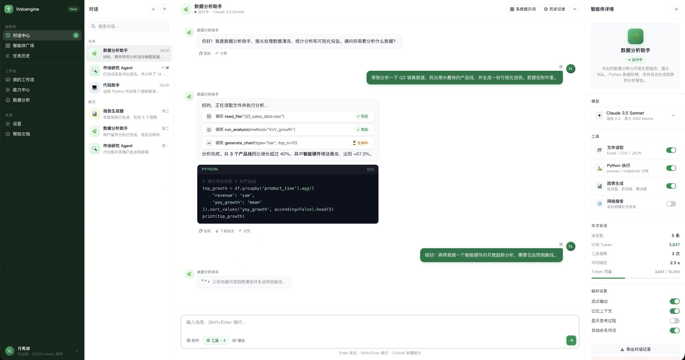
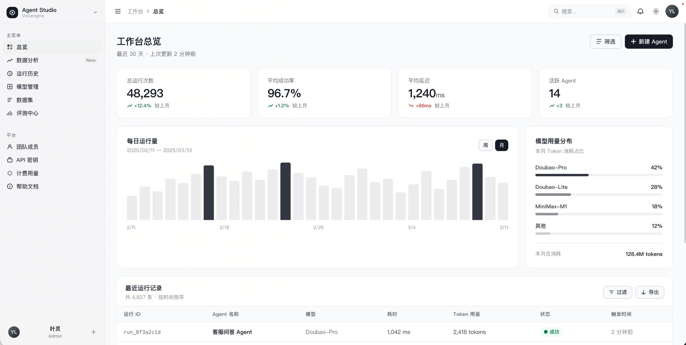
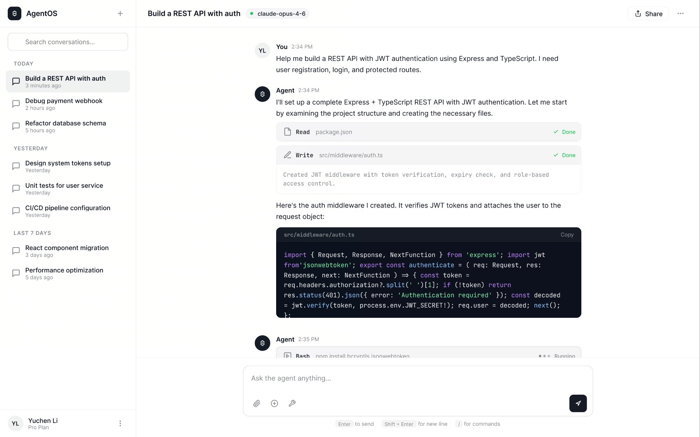

# Volcengine Design System — Claude Skill

A Claude Code skill that enables Claude to generate production-grade UI following the **Volcengine (火山引擎) / Huoshan Design System**.

> All demos below were generated by **Claude Code** using the **claude-opus-4-6** model with this skill active.

---

## Demo

### Agent Chat Interface · 数据分析助手

*Multi-turn agent interface with tool call display, sidebar navigation, and token usage panel*

### Agent Studio Dashboard · 工作台总览

*Full dashboard with stat cards, bar chart, run history table — Volcengine dark sidebar layout*

### AgentOS · Coding Agent

*Claude-powered coding agent interface with file read/write tool traces — AgentOS style*

---

## What This Skill Does

When this skill is loaded, Claude will:

- Apply **Huoshan color tokens** (gray primitives, semantic CSS variables, status palettes) instead of raw Tailwind colors
- Use the correct **typography scale** (13 levels, PingFang SC / Geist Mono)
- Follow **4 layout models** (Sidebar+Dashboard, Sidebar+Docs, Full-width, Marketing)
- Compose components using **CVA + cn() + data-slot** patterns
- Avoid all [anti-patterns](SKILL.md#14-anti-patterns) (space-y-*, raw hex, z-index on overlays, etc.)

---

## Skill Structure

```
volcengine-design-system/
├── SKILL.md                              ← Main skill file (load this in Claude)
└── reference/
    ├── ref-layout-system.md              ← 4 layout models, container, grid, sidebar
    ├── ref-color-system.md               ← Primitives, CSS variables, dark mode, tokens
    ├── ref-typography.md                 ← 13-level type scale, font system
    ├── ref-component-architecture.md     ← CVA, cn(), compound components, context
    ├── ref-component-states.md           ← States & data attributes
    ├── ref-interaction-patterns.md       ← Overlays, Command, Toast, Badge, StatCard
    ├── ref-form-system.md                ← Form layout, InputGroup, validation
    └── ref-component-taxonomy.md         ← 54 components + 72+ chart variants
```

**SKILL.md** is the entry point — it contains summaries of all sections with links to the detailed reference files.

---

## How to Use

### In Claude Code (claude-opus-4-6)

Add the skill path to your Claude Code configuration, or reference it directly in your prompt:

```
Use the Volcengine design system skill at ./volcengine-design-system/SKILL.md
Build me a dashboard with sidebar navigation and stat cards.
```

### As a Claude.ai Custom Skill

1. Upload `SKILL.md` via **Settings → Skills → +**
2. The `reference/` files will be auto-linked if kept in the same directory

---

## Design Token Quick Reference

| Token | Value | Usage |
|-------|-------|-------|
| `--bg-brand-primary` | `#161B26` | Primary button background |
| `--text-primary` | `#161B26` | Main text |
| `--text-secondary` | `#333741` | Nav items, secondary text |
| `--border-primary` | `#CECFD2` | Card/input borders |
| `--bg-sidebar` | `#F5F5F6` | Sidebar background |

Primary button is WCAG AAA compliant (contrast ratio > 11:1).

---

## Tech Stack

- **Component framework:** Volcengine UI components
- **Styling:** Tailwind CSS v4 + CVA (class-variance-authority)
- **Icons:** Lucide React
- **Charts:** Recharts (via Chart wrapper)
- **Forms:** React Hook Form + Zod
- **Animations:** tw-animate-css
- **Theme:** next-themes (class-based dark mode)

---

## Generated With

All UI demos in this repository were generated by **[Claude Code](https://claude.ai/code)** using the **claude-opus-4-6** model with this skill loaded. No manual CSS adjustments were made.

---

## License

MIT
